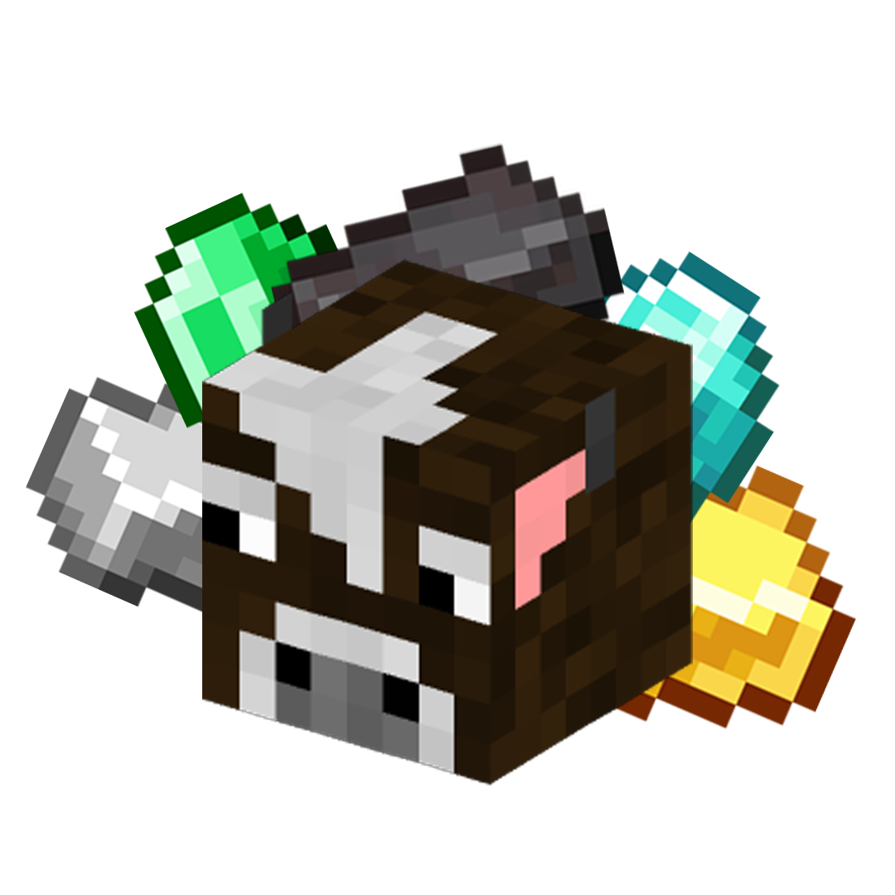

<div align="center">
  

  # ProductiveCows
  
  [](https://neoforged.net/)
  [](https://www.curseforge.com/minecraft/mc-mods/productive-cows)
  [](#)
  [](LICENSE)
</div>

ProductiveCows is a modern, data-driven resource generation mod for Minecraft. Breed, milk, and process custom material cows to automate your resource gathering! 

Fully compatible with popular pipe and energy mods like Mekanism, Pipez, Create, and Thermal Series.

---

## 🛠️ Adding Custom Cows (For Modpack Devs)

ProductiveCows is **100% Data-Driven**. You can add new cows without writing a single line of Java by creating a simple JSON file in your Datapack (or via KubeJS)!

Create a file in your datapack at: `data/<your_namespace>/material_cows/my_custom_cow.json`

```json
{
  "name": "Vibranium",
  "tier": 5,
  "fluidId": "productivecows:molten_vibranium",
  "materialColor": "#800080",
  "breedChance": 0.05,
  "baseYield": 100,
  "parent1": "productivecows:diamond",
  "parent2": "productivecows:obsidian",
  "coolingResultTag": "c:ingots/vibranium"
}
```

That's it! The mod will automatically register the cow and process the cooling into the correct tag/item.

---

## 🐛 Issues and Bug Reports

Found a bug or have a suggestion? We'd love to hear it! 
Please open an issue in the **[Issues Tab](../../issues)**. 

**Important:** Please ensure you select and fill out the provided Issue Template. Bug reports that don't follow the template may take much longer to resolve.